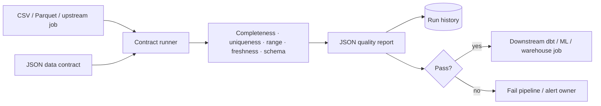
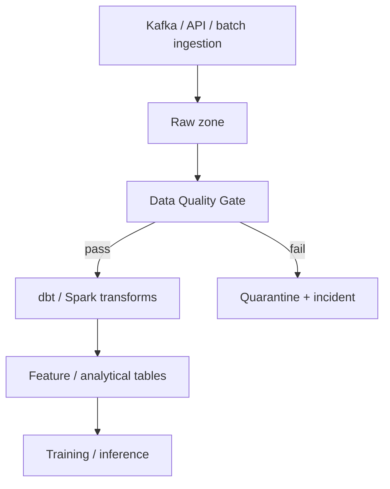

# Data Quality & Observability Gate

A declarative **data-contract validator** designed to sit in front of ML, analytics and data-engineering pipelines.

Instead of burying assumptions inside notebooks, a dataset gets a versionable JSON contract. The CLI validates CSV/Parquet data, emits a machine-readable report, persists run history and returns a pipeline-friendly exit code.

## Architecture



## Pipeline semantics

`data-quality check` returns:

- **0** — contract passed;
- **1** — data was readable but one or more quality checks failed;
- **2** — configuration/input error such as malformed contract or unsupported file format.

That distinction matters in CI and orchestration: a broken configuration is not the same incident as a real deterioration in source data.

## Example contract

```json
{
  "dataset": "transactions",
  "checks": [
    {"type": "required_columns", "columns": ["transaction_id", "amount", "event_time"]},
    {"type": "row_count", "minimum": 1},
    {"type": "unique_rate", "column": "transaction_id", "minimum": 0.999},
    {"type": "null_rate", "column": "amount", "maximum": 0.001},
    {"type": "range", "column": "amount", "low": 0, "high": 1000000},
    {"type": "freshness", "column": "event_time", "max_age_minutes": 60}
  ]
}
```

The repository includes this contract under `contracts/transactions.json`.

## Run locally

```bash
pip install -e '.[dev]'

data-quality check \
  --data transactions.parquet \
  --contract contracts/transactions.json \
  --history quality_history.db \
  --output report.json
```

Inspect history:

```bash
data-quality history \
  --database quality_history.db \
  --dataset transactions \
  --limit 20
```

## Example output

```json
{
  "dataset": "transactions",
  "passed": false,
  "rows": 250000,
  "columns": 17,
  "checks": [
    {
      "name": "unique_rate:transaction_id",
      "passed": true,
      "observed": 1.0,
      "threshold": 0.999
    },
    {
      "name": "null_rate:amount",
      "passed": false,
      "observed": 0.014,
      "threshold": 0.001
    }
  ],
  "run_id": 42
}
```

## Checks implemented

- required columns;
- minimum row count;
- null-rate thresholds;
- uniqueness-rate thresholds;
- numeric range constraints;
- timestamp freshness/SLA checks.

The runner is deliberately small and extensible: additional checks can be added without changing the contract execution flow.

## Repository layout

```text
data-quality-observability/
├── contracts/
│   └── transactions.json
├── dq/
│   ├── cli.py
│   ├── contracts.py
│   └── history.py
├── tests/
│   └── test_contracts.py
├── quality.py
├── Dockerfile
├── pyproject.toml
└── .github/workflows/ci.yml
```

## How it fits a data platform



## Production evolution

- Pandera / Great Expectations adapters;
- schema-registry integration;
- anomaly checks against historical distributions;
- ownership and lineage metadata;
- Slack/PagerDuty notifications;
- OpenTelemetry traces;
- Prometheus quality metrics;
- S3/GCS data sources;
- dbt test result ingestion;
- Airflow/Dagster operator wrappers.

## Interview topics demonstrated

`data contracts` · `data quality` · `freshness SLA` · `schema validation` · `pipeline gates` · `observability` · `quarantine` · `data lineage` · `Parquet` · `CI/CD for data`
